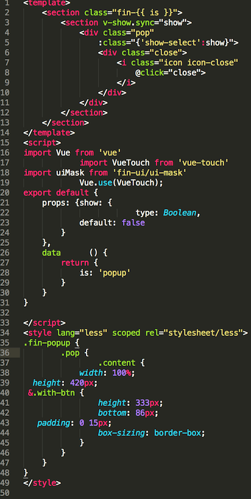
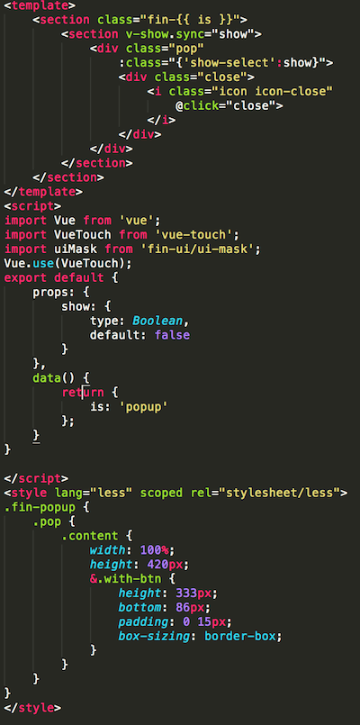

# beautify-vue
>vue文件美化

## 用法

1. 进入vue目录
2. 命令行输入：`bvue`

## 安装

`npm install -g beautify-vue`

## 其他

**指定格式化目录**

命令行第二个参数，例如：`bvue ./app/component`

**代码检查**

```
bvue check vue
bvue check js
bvue check css

```

## 效果

转换对比

 vs 


